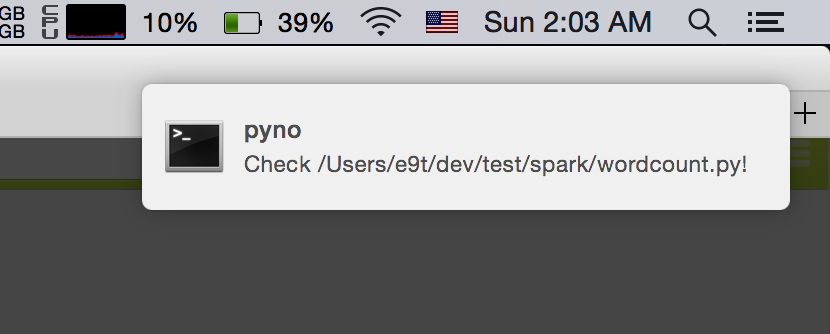

# pyno

Python notifications for Mac OS.

<blockquote class="twitter-tweet" data-cards="hidden" lang="en">
Mac OS terminal-notifier과 파이썬 logging 모듈을 적절히 조합해서 특정 레벨 이상의 로그가 뜨거나 exception이 발생하면 알림을 띄워주는 라이브러리가 있었으면 좋겠다. <a href="http://t.co/jyW6su6p3u">pic.twitter.com/jyW6su6p3u</a>
&mdash; Lucy Park (@echojuliett) <a href="https://twitter.com/echojuliett/status/614740315816116224">June 27, 2015</a></blockquote>

## Installation

    pip install git+https://github.com/e9t/pyno.git

> WARNING: Those using tmux [may have some issues](https://github.com/SeTeM/pync/issues/22). Installing [my version of pync](https://github.com/e9t/pync) might solve the issue.

## Usage

`import pyno` (desirably) at beginning of script.
